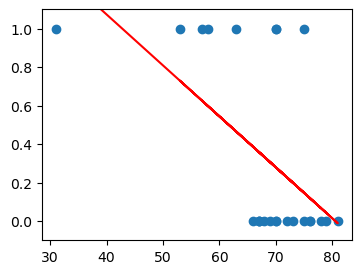
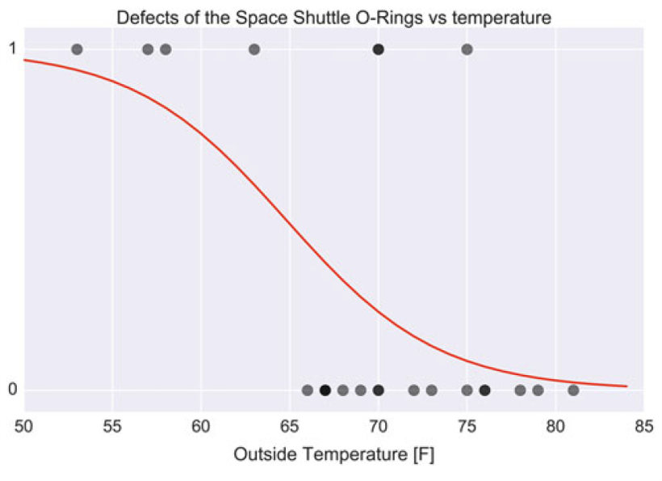

# Tests on Discrete Data -- Logistic Regression
reference books:  
* *An introduction to Statistics with Python with Applications in the Life Science*, Thomas Haslwante.
* *Introduction to Econometrics*, James H. Stock, Mark W. Watson.
* *Practical Statistics for Data Scientists*, Peter Bruce, Andrew Bruce, and Peter Gedeck.
* *Python for Probability, Statistics, and Machine Learning*, José Unpingco

I will call them book1, book2, book3... for short.

> I can only understand the logistic regression part in reference books. For GLM - **Generalized Linear Model**, how about wait me for some time? Thank
you.

## Why Logistic?

Mankind is a brave species. We are always looking for furture exploration.
However, we must admit that the road of adventure is not always smooth.

On January 28, 1986, 7 brave astronaut lost their life when the space shuttle
*Challenger* exploded. We had to investigate the disaster for preventing future
dangerous. In the end, the reason had been found -- O-ring seal failure in
right SRB due to cold weather and wind shears.[(source:Wikipedia)](https://en.wikipedia.org/wiki/Space_Shuttle_Challenger_disaster)

So, problem is what's the relation between O-ring fail and the temperature.
One approach is we set $Y$ to represent if the O-ring failed. Then perform a
linear regression between $Y$ and temperature(and other covariates if
needed). OLS will give us a model, and we can use it to do the analysis. But
, if we draw the data and the fitted line, we will get something like this:  

OK, fom the red line, we can interpret that o-rings are more likely to fail
with cold temperature. But, do you really think that this is a good model,
considering that the outcome contains only two possible outcomes 0, 1.

Ah, we need new method(s).(Actully, to perform a regression on dummy dependent
variables, there are many ways. Two popular methods are Probit and Logit/
Logistic regression, for example. In this post, we will only cover Logit
regression.)

## Logistic Regression

The logistic regression provide us a new view -- to think that the covariates
affect the probability that the outcome is 1. Look at the above example, in
logistic regression, we shall say that "with lower temperature, the probability
of o-ring failure will get higher".

Considering the probability will always fall in $[0, 1]$, our model is set as:  

$$
\text{Pr}(Y=1|X) = \frac{1}{1 + \exp(-\mathrm{\beta}^{T} \mathbf{X})}.
$$

Here $\mathbf{X}$ is the covariate matrix; $\mathbf{\beta}$ is the parameters'
vector. Usually, we use MLE to estimate the parameters. The function above will
always fall in $[0, 1]$. By the way, the function is actually a CDF, and it's
usually called logistic function. And in Probit regression, which we mentioned
above, the model use the CDF of standard normal distribution.

Maybe we can take a look at the figure showing the logistic regression outcome
:  

(source: book1, page 231)

As we can see in the picture above, there are more points on the line of $y=1$
on the left-hand side, where the red line is higher ie. where the predicted
probabilty is higher.

OK, you might say that we can also view the predicted value in the linear
regression as the probability. Yes, you are right, but in linear model the
probability change linearly, this may not be true. So, Another adventage of logistic regression is that if the probability is non-linear, it "may" capture
the non-linearty, compare to linear regression.

## How to interpret the coefficients?

In book2, it says that the coeffiecients of the logistic model are hard to
interpret compare to the linear regression. While, it seems that the data
scientists go further. In book3, there is a interpretation of the coefficients.
To introduce that, let's start with the notion of **odds**:  

$$
\text{Odds}(Y=1|\mathbf{X}) = \frac{\text{Pr}(Y=1|\mathbf{X})}
{1 - \text{Pr}(Y=1|\mathbf{X})}.
$$

"In terms of probabilities, odds are the probability of an event divided by the
probability that the event will not occur."

According to this definition, we can get the odds of the logistic model:  

$$
\text{Odds}(Y=1|\mathbf{X}) = \exp (\mathbf{\beta}^{T} \mathbf{X}).
$$

Why not take a log value:  

$$
\ln \text{Odds}(Y=1|\mathbf{X}) = \mathbf{\beta}^{T} \mathbf{X}
= \beta_{0} + \beta_{1} x_{1} +\cdots +\beta_{s} x_{s}.
$$

Using this procedure, we can extract the linear function inside the the logistic
model. Actually, we get a function here:  

$$
\ln \frac{y}{1-y}.
$$

It's called log odds function or logit function(So the logistic regression
is also called logit regression sometimes? I don't know).

Now, think of $\mathbf{\beta}^{T} \mathbf{X}$ as the input. It first enter the
logistic function, which give us the probability. Then, the probability goes
into the logit function, and we get the input back. As you can see, the logit
function is the inverse function of logistic function.

OK, now back to the coefficients of the logit regression.
Let's say we obtain a parameter $\beta_{t}$, it just means that when the
covariates $x_{t}$ get a unit change, the log odds will change $\beta_{t}$,
and the odds will change $\exp (\beta)$.

That's all I know about the logistic regression by far. Sorry for my poor
knowledge. Aha, don't forget to check out the code!
